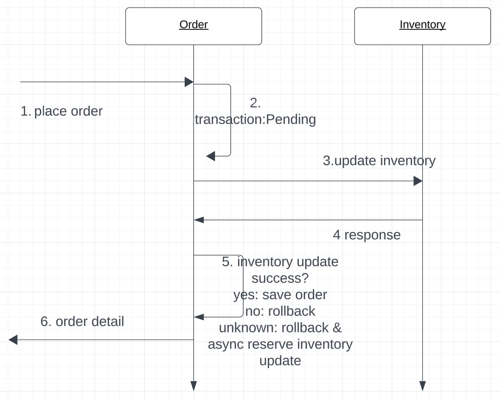

## About The Project

This is a Spring cloud demo demonstrating some core functions.

### Project architecture


### Project structure

There are six modules in this project, every module is a spring boot project.

``````
├── README.md
├── common          -- common functionalities shared by all modules
│   ├── pom.xml
│   └── src
├── config-server   -- spring cloud config
│   ├── Dockerfile  
│   ├── config-repo 
│   ├── pom.xml
│   └── src
├── docker-compose.yml
├── eureka          -- eureka registry service
│   ├── Dockerfile
│   ├── pom.xml
│   └── src
├── gateway         -- spring cloud gateway
│   ├── Dockerfile
│   ├── pom.xml
│   └── src
├── order           -- order service
│   ├── Dockerfile
│   ├── pom.xml
│   └── src
├── pom.xml
├── product         -- product service
│   ├── Dockerfile
│   ├── pom.xml
│   └── src
└── user            -- user service
    ├── Dockerfile
    ├── pom.xml
    └── src
``````

### Tech stack

Spring Boot, Spring Cloud Gateway, Spring Cloud eureka, Spring Data JDBC, Spring MVC, H2, Docker Compose ...

Spring Boot version: 2.7.18

Spring Cloud version: 2021.0.8

JDK version: 21

## Getting started

#### Installation

``````bash
## build and install all the modules in the project directory
mvn install -Dmaven.test.skip=true
``````

There are two ways to start the project. Each module has two property files: one for the Docker Compose environment (application-dev.properties) and another forapplication.properties). local startup (

1. Use docker-compose

``````bash
## Build docker images and start all the containers, 
## start order: config-server -> eureka -> (gateway, user, order, product)
docker-compose up -d
``````

2. Alternatively, you can manually start all the services one by one using `mvn spring-boot:run`. The config server is not needed in the local environment.
3. The gateway can be accessed at the URL localhost:8088. The first time you visit this domain, a login form will appear for authentication. There are two initial users: one with the username "user" and password "password," whoivileges, and another with the username "admin" and password "admin," who has administrative privileges. Currently, there are only two predefined roles, and authorization management is implemented on the Cloud Gateway using Spring Security, based on URL patterns and HTTP methods. 

#### Functionality:

- Product Service:

  - List products GET  http://localhost:8088/v1/products
  - Create Product POST http://localhost:8088/v1/products
  - Update Product PUT http://localhost:8088/v1/products
  - Delete product by id:  DELETE http://localhost:8088/v1/products/{id}
  - Get product by id GET http://localhost:8088/v1/products/{id}
  - Update inventory by product id PUT http://localhost:8088/v1/inventories/{id}
  - Batch reduce inventory from order request POST http://localhost:8088/v1/inventories/
  - List inventories GET http://localhost:8088/v1/inventories/

- Order Service:

  - Create orders POST http://localhost:8088/v1/orders
  - Update order details PUT http://localhost:8088/v1/orders/{orderId}
  -  Get order GET http://localhost:8088/v1/orders/{orderId}
  - Order list GET http://localhost:8088/v1/orders

- User Service:

  - Ger User  GET  http://localhost:8088/v1/users/{id}
  - Create User POST  http://localhost:8088/v1/users
  - All the authentication and authorization happened in the Spring Cloud Gateway, which utilizes spring security to ensure safety. The default configuration 

- Key workflows include placing and updating orders, as these are typical scenarios for distributed transactions.

  

In this demo, the Order service acts as a coordinator in this workflow, it has an order `order_change_transaction` dedicated to managing the status of the distributed transaction.

From the beginning of the distributed transaction, this table will track the entire state of the transaction. The most challenging part occurs at step 5, when the order service must verify whether the inventory update was successful.

There are three possible responses to the inventory updating state of the transaction:

1. Inventory **Success**: If the transaction is successful, it simply needs to save the order and change the transaction status to "Finished."

2. **Inventory Update Failed**: If the inventory update fails, the transaction must be canceled.

3. **Unknown**: If the response is unknown, the transaction should also be canceled. In this case, the user should receive an immediate response indicating the failure. Following this, the transaction coordinator is responsible for checking the status of the inventory update and implementing any necessary reverse or compensatory actions.n needs to be canceled. 

### Detail description

- Service Registration and Discovery: 
  - Use Eureka for service registration and discovery.
- Spring Cloud Gateway Integration: 
  - Implement Spring Cloud Gateway for routing requests (based on URL prefixes) to microservices. 
- Load Balancing
  - Use Spring Cloud LoadBalancer instead of Ribbon for client-side load balancing.
- Distributed Configuration: Implement centralized configuration management
  using **Spring Cloud Config Server**.
  - For the local environment, the config server is not needed, all the services just read the local application.properties or application.yml respectively.
  - For docker-compose setup, those services first read local application-dev.properties or application.yml for the **config-server-URL** at starting up and ask the config server for the rest of the properties.
- Circuit Breaker: 
  - Use Resilience4j on the gateway server and implement a global fallback endpoint for demonstrating.
- Logging and Monitoring: 
  - Integrate with Spring Cloud Sleuth for tracing.
  - When deployed with docker-compose, the zipkin server is used to collect trace data.

### Database

The schemas of the project are located in the `src/main/resource`. Almost all schemas in this demo lack audit fields, and all the deleting actions are physical deletions.  

#### Testing

below is a screenshot of the test coverage report. for detailed information, check the HTML report from this link   [index.html](htmlReport/index.html) 


There is only one pair of tests in this test suit using spring cloud contracts, which is a simple example for demonstration. The contract is located in `test/resource/contracts` under the product (**producer side**) module, The consumer side test is in the order module named `ProductContractTest` 

### ToDo & Restriction

1. Many configurations are just for demonstrating 

2. Currently, there is no global error handling, also no per-service error handling mechanism.

3. eureka and config-server only support single-instance deployment, the whole project hasn't been tested in a cluster environment.
4. ...

##### 


