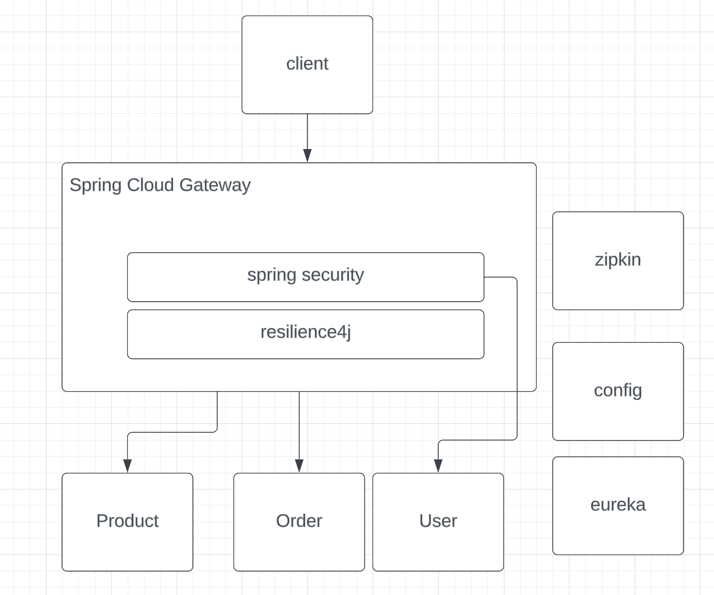
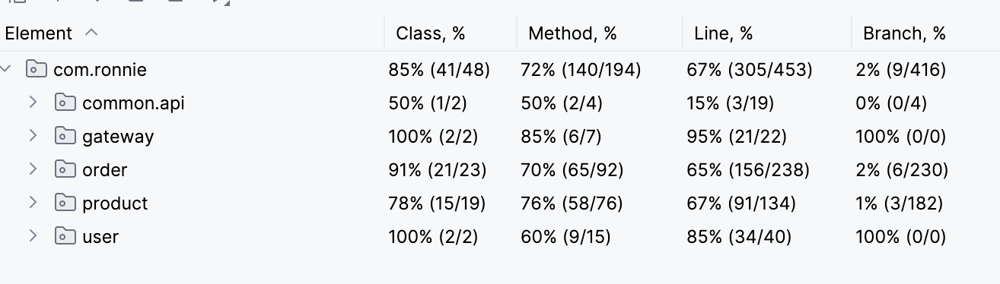

## About The Project

This is a Spring cloud demo demonstrating some core functions.

### Project architecture



### Project structure

There are six modules in this project, every module is a spring boot project.

``````
├── README.md
├── common          -- common functionalities shared by all modules
│   ├── pom.xml
│   └── src
├── config-server   -- spring cloud config
│   ├── Dockerfile  
│   ├── config-repo 
│   ├── pom.xml
│   └── src
├── docker-compose.yml
├── eureka          -- eureka registry service
│   ├── Dockerfile
│   ├── pom.xml
│   └── src
├── gateway         -- spring cloud gateway
│   ├── Dockerfile
│   ├── pom.xml
│   └── src
├── order           -- order service
│   ├── Dockerfile
│   ├── pom.xml
│   └── src
├── pom.xml
├── product         -- product service
│   ├── Dockerfile
│   ├── pom.xml
│   └── src
└── user            -- user service
    ├── Dockerfile
    ├── pom.xml
    └── src
``````

### Tech stack

Spring Boot, Spring Cloud Gateway, Spring Cloud eureka, Spring Data JDBC, Spring MVC, H2, Docker Compose ...

Spring Boot version: 2.7.18

Spring Cloud version: 2021.0.8

JDK version: 21

## Getting started

#### Installation

``````bash
## build and install all the modules in the project directory
mvn install -Dmaven.test.skip=true
``````

There are two ways to start up the project. Every module has 2 property files, one for the docker-compose environment (**application-dev.properties**), and the other (**application.properties**)for local start-up

1. Use docker-compose

``````bash
## Build docker images and start all the containers, 
## start order: config-server -> eureka -> (gateway, user, order, product)
docker-compose up
``````

2. Or manually start all the services using `mvn spring:boot run` one by one. Config-server is not needed in the local environment. 

#### Functionality:

- Product Service:

  - List products GET  http://localhost:8088/v1/products
  - Create Product POST http://localhost:8088/v1/products
  - Update Product PUT http://localhost:8088/v1/products
  - Delete product by id:  DELETE http://localhost:8088/v1/products/{id}
  - Get product by id GET http://localhost:8088/v1/products/{id}
  - Update inventory by product id PUT http://localhost:8088/v1/inventories/{id}
  - Batch reduce inventory from order request POST http://localhost:8088/v1/inventories/
  - List inventories GET http://localhost:8088/v1/inventories/

- Order Service:

  - Create orders POST http://localhost:8088/v1/orders
  - Update order details PUT http://localhost:8088/v1/orders/{orderId}
  -  Get order GET http://localhost:8088/v1/orders/{orderId}
  - Order list GET http://localhost:8088/v1/orders

- User Service:

  - Ger User  GET  http://localhost:8088/v1/users/{id}
  - Create User POST  http://localhost:8088/v1/users
  - All the authentication and authorization happened in the Spring Cloud Gateway, which utilizes spring security to ensure safety. The default configuration 

- Some of the important workflows are placing orders and updating orders because those are typical scenarios.  

  

In this demo, the Order service acts as a coordinator in this workflow, it has an order order_change_transaction dedicated to managing the status of the distributed transaction.

### Detail description

- Service Registration and Discovery: 
  - Use Eureka for service registration and discovery.
- Spring Cloud Gateway Integration: 
  - Implement Spring Cloud Gateway for routing requests (based on URL prefixes) to microservices. 
- Load Balancing
  - Use Spring Cloud LoadBalancer instead of Ribbon for client-side load balancing.
- Distributed Configuration: Implement centralized configuration management
  using **Spring Cloud Config Server**.
  - For the local environment, the config server is not needed, all the services just read the local application.properties or application.yml respectively.
  - For docker-compose setup, those services first read local application-dev.properties or application.yml for the **config-server-URL** at starting up and ask the config server for the rest of the properties.
- Circuit Breaker: 
  - Use Resilience4j on the gateway server and implement a global fallback endpoint for demonstrating.
- Logging and Monitoring: 
  - Integrate with Spring Cloud Sleuth for tracing.
  - When deployed with docker-compose, the zipkin server is used to collect trace data.

### Database

Almost all schemas in this demo 

#### Testing

below is a screenshot of the test coverage report. for detailed information, check the HTML report from this link   [index.html](htmlReport/index.html) 



There is only one pair of tests in this test suit using spring cloud contracts, which is a simple example for demonstration. The contract is located in `test/resource/contracts` under the product (**producer side**) module, The consumer side test is in the order module named `ProductContractTest` 

### ToDo & Restriction

1. Many configurations are just for demonstrating 

2. Currently, there is no global error handling, also no per-service error handling mechanism.

3. eureka and config-server only support single-instance deployment, the whole project hasn't been tested in a cluster environment.

##### 


